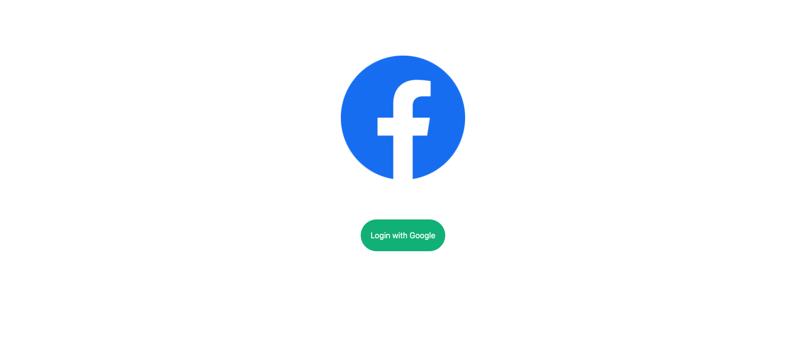
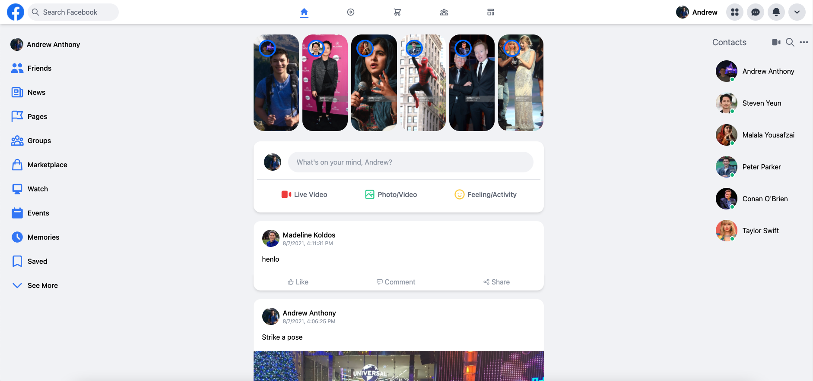
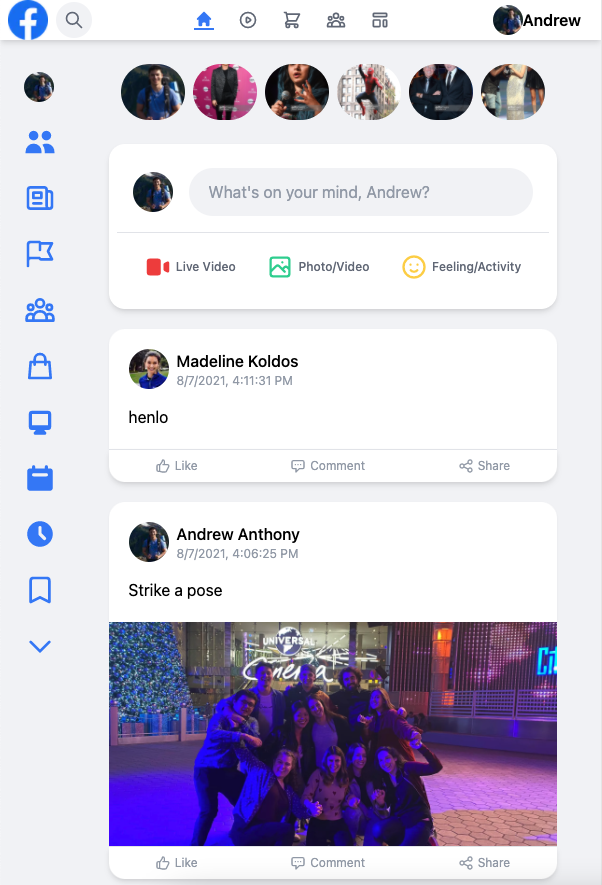

# Functional Facebook Clone

## What, Why, and HOW
With this project, I wanted to put my design skills to the test by replicating the design of Facebook. I know it can be tricky for companies to evaluate the skills of entry-level/junior-level engineers. I hope that replicating the design of one of the top websites in the world shows that I have the front-end chops to create simple, professional-looking, responsive web applications. Furthermore, this clone has a fully functional user login through Google, and it also has a fully functional live feed where users can make posts and attach an image/video to each post. I'm really proud of this application, and I hope you enjoy checking it out!
 

<b>Tools:<b>JavaScript, React.js, Next.js, Tailwind CSS, Firestore, Node.js

# Links
Link to deployed application: https://functional-facebook-clone.vercel.app/
 
Link to GitHub repo: https://github.com/andrew1835/functional-Facebook-clone

# Screenshot

What the web app looks like when you first load it

 

The web app after the user has logged in:

 

The web app on a smaller screen size (still on a desktop, the app is optimized for different screen sizes on desktop/laptop):

